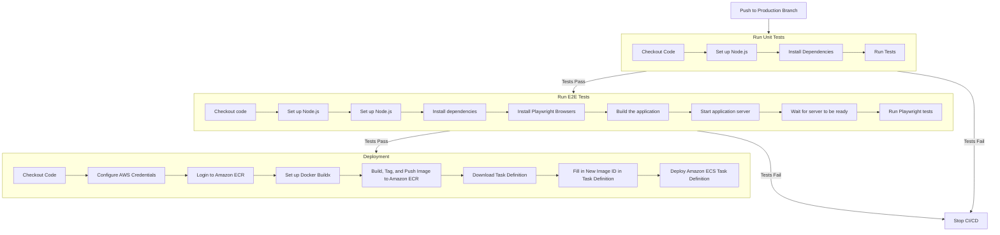

## Getting Started

### 1. Start project with local machine

- สั่ง npm install หลังจาก clone project มาใหม่
- สั่ง npm run dev เพื่อเริ่มต้นการพัฒนา

```bash
npm install # first time only
npm run dev
```

Application จะเริ่มทำงานที่ [`http://localhost:3000/`](http://localhost:3000/)

### 2. Start project with docker

> ต้องทำการติดตั้ง Docker ก่อน ดูรายละเอียดได้ที่ [Docker Desktop](https://www.docker.com/products/docker-desktop/)

#### 2.1 Develop environment {#2.1}

คำสั่งในหัวข้อนี้เรียกใช้ไฟล์ `.env.development`

##### 2.1.1 Build docker image

ใช้คำสั่ง Makefile script

```bash
make build-development
```

หรือใช้ docker-compose โดยตรง

```bash
docker compose -f docker/development/docker-compose.yml build
```

##### 2.1.2 Start docker container

ใช้คำสั่ง Makefile script

```bash
make start-development
```

หรือใช้ docker-compose โดยตรง

```bash
docker compose -f docker/development/docker-compose.yml up -d
```

Application จะเริ่มทำงานที่ [`http://localhost:3001/`](http://localhost:3001/)

##### 2.1.3 Stop docker container

ใช้คำสั่ง Makefile script

```bash
make stop-development
```

หรือใช้ docker-compose โดยตรง

```bash
docker compose -f docker/development/docker-compose.yml down
```

#### 2.2 Production environment {#2.2}

คำสั่งในหัวข้อนี้เรียกใช้ไฟล์ `.env.production`

##### 2.2.1 Build docker image

ใช้คำสั่ง Makefile script

```bash
make build-production
```

หรือใช้ docker-compose โดยตรง

```bash
docker compose -f docker/production/docker-compose.yml build
```

##### 2.2.2 Start docker container

ใช้คำสั่ง Makefile script

```bash
make start-production
```

หรือใช้ docker-compose โดยตรง

```bash
docker compose -f docker/production/docker-compose.yml up -d
```

Application จะเริ่มทำงานที่ [`http://localhost:3003/`](http://localhost:3003/)

##### 2.2.3 Stop docker container

ใช้คำสั่ง Makefile script

```bash
make stop-production
```

หรือใช้ docker-compose โดยตรง

```bash
docker compose -f docker/production/docker-compose.yml down
```

## Testing

### 1. Unit Testing

- unit test ใช้ library [vitest](https://vitest.dev/) ในการทำ unit test
- file config ของ vitest อยู่ที่ `vitest.config.mts`
- เบื้องต้นได้ทำการ config ให้ vitest อ่านไฟล์ที่อยู่ใน `src` และมีรูปแบบไฟล์ `*.test.{js,jsx,ts,tsx}` ทุกไฟล์โดยอัตโนมัติเมื่อ run unit test

#### 1.1 Run unit test

สามารถรัน unit test ได้โดยใช้คำสั่ง

```bash
npm run test
```

#### 1.2 Run unit test with UI report

สามารถรัน unit test แบบ UI ได้โดยใช้คำสั่ง

```bash
npm run test:ui
```

โดย UI report จะอยู่ที่ [`http://localhost:51204/__vitest__/#/`](http://localhost:51204/__vitest__/#/)

#### 1.3 Run unit test with json report

สามารถรัน unit test แบบ json report ได้โดยใช้คำสั่ง

```bash
npm run test:json
```

โดย json report จะอยู่ที่ `./test-results.json`

### 2. Integration & E2E Testing

- integration & E2E test ใช้ library [playwright](https://playwright.dev/) ในการทำ integration & E2E test
- file config ของ integration & E2E test อยู่ที่ `playwright.config.ts`
- เบื้องต้นได้ทำการ config ให้ playwright อ่านไฟล์ที่อยู่ใน `src/tests` และมีรูปแบบไฟล์ `*.spec.{js,jsx,ts,tsx}` ทุกไฟล์โดยอัตโนมัติเมื่อ run test

#### 2.1 How to run integration & E2E test

สามารถ run integration & E2E test ได้โดยใช้คำสั่ง

```bash
npm run test:e2e # run integration & E2E test
```

```bash
npm run test:e2e:report # show report
```

#### 2.2 How to run integration & E2E test with UI report

สามารถ run integration & E2E test แบบ UI ได้โดยใช้คำสั่ง

```bash
npm run test:e2e:ui
```

โดย Playwright UI จะเปิดขึ้นมาโดยอัตโนมัติผ่าน Chromium

## Component Documenation (Storybook)

- Component Doc ใช้ library [Storybook](https://storybook.js.org/) ในการทำ storybook
- file config ของ storybook อยู่ที่ `.storybook/main.js` และ `.storybook/preview.js`
- สามารถเขียน story ของ component ได้ที่ `src/stories/{component-name}/{component-name}.stories.{js,jsx,ts,tsx}` และจะอ่านไฟล์ที่อยู่ใน `src/stories` ทุกไฟล์โดยอัตโนมัติเมื่อ run storybook

สามารถ start storybook ได้โดยใช้คำสั่ง

```bash
npm run storybook
```

storybook จะเปิดขึ้นมาที่ `http://localhost:6006/`

## Setup

### 1. Environment Variables

สามารถ set environment variables ได้โดยการแก้ไขไฟล์ `.env.local` หรือ `.env.development` หรือ `.env.production`

`.env.local` จะถูก ignore จาก git และใช้สำหรับการ set environment variables ใน local machine เท่านั้น

`.env.development` เบื้องต้นจะถูกเรียกใช้เมื่อใช้คำสั่ง `npm run dev` หรือเมื่อรันด้วย docker ใน environment ของ development ตามหัวข้อ [Getting Started ข้อที่ 2.1](#2.1)

`.env.production` เบื้องต้นจะถูกเรียกใช้เมื่อใช้คำสั่ง `npm run build` และ `npm run start` หรือเมื่อรันด้วย docker ใน environment ของ production ตามหัวข้อ [Getting Started ข้อที่ 2.2](#2.2)

รายละเอียดอื่น ๆ ของ environment variables สามารถดูได้ที่ [NextJS Environment Variables](https://nextjs.org/docs/basic-features/environment-variables)

### 2. SEO Optimization

#### 2.1 Sitemap & Robot

Sitemap และ Robot จะถูก generate โดยอัตโนมัติจากไฟล์ `src/app/sitemap.ts` และ `src/app/robot.ts` ตามลำดับ

โดยจำเป็นจะต้องมีการ config ในไฟล์ `.env.development` และ `.env.production` ดังนี้

```bash
NEXT_PUBLIC_APP_URL=https://example.com # ต้องเป็น URL ที่จะใช้ในการ production จริง เพื่อให้ google สามารถ crawl url ได้ถูกต้อง
```

#### 2.2 Metadata

ตัวอย่างการใช้งาน metadata สามารถดูได้ที่ `src/app/layout.tsx`

```tsx
// FIXME: change the metadata to match your project
// opengraph images should be 1200x630
export const metadata: Metadata = {
  title: "GrowsIT Next.js Starter",
  description: "Generated by create next app",
  openGraph: {
    type: "website",
    locale: "th_TH",
    description:
      "GrowsIT Next.js Boilerplate Please change this description to your own",
    images:
      "https://carfinn-s3-dev.s3.ap-southeast-1.amazonaws.com/car/customer_document/pf17188544540.jpg",
  },
};
```

รายละเอียดของ metadata สามารถดูได้ที่ [NextJS Metadata File Conventions](https://nextjs.org/docs/getting-started/project-structure#metadata-file-conventions)

## CI/CD

workflow


